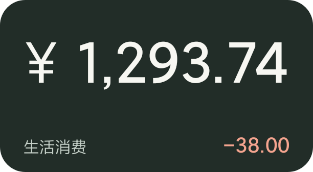
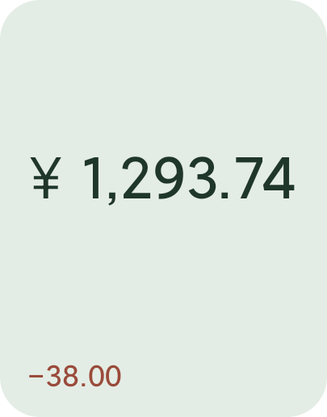

<div align="center">

# 余额手账

把散落在通知栏里的动账消息，整理成一眼能看懂的余额和账单。

[下载 APK](https://github.com/Pyuxiz/balance-ledger-android/releases/latest) · [使用说明](#怎么用) · [银行兼容情况](#银行兼容情况)

</div>

余额手账是一款本地运行的 Android 小工具。它从你允许读取的银行 App 通知和新到短信中提取交易，不需要登录网银，也不会连接银行接口。余额、卡片和账单都留在手机上。

<table>
  <tr>
    <td></td>
    <td></td>
    <td></td>
  </tr>
</table>

> 演示图使用虚构金额，由小组件实际绘制器生成。

## 能做什么

- 多张银行卡分别记录余额和收支，账单按交易时间排列。
- 同一笔交易如果同时收到 App 通知和短信，会合并成一条记录。
- 添加卡片时直接选择银行模板，也可以自己修改短信号码、银行落款和 App 包名。
- 从通知栏中出现过的应用里选择银行 App，不必手动查包名。
- 提供 2×1、2×2、4×1、4×2 四个小组件入口，放到桌面后仍可缩放。
- 每个小组件可以单独选择卡片、颜色和隐私模式。多选卡片时显示余额合计。
- 浅色、深色与四套小组件配色都使用同一个绘制器，设置页预览就是桌面实际画面。

## 怎么用

1. 在银行 App 中开启消费或动账通知，或者开通银行短信通知，并允许通知显示完整内容。
2. 在余额手账中添加卡片，选择银行并填写四位卡尾号。初始余额可以留空。
3. 从当前通知列表中选中对应的银行 App，然后到「权限与接收」开启通知读取。
4. 如果希望直接接收新短信，再授予短信接收权限。应用不会读取短信历史。
5. 把小组件放到桌面，再回到「小组件外观」选择要显示的卡片。

带有明确余额的银行短信会校准余额；只有交易金额的通知会在现有余额上暂记增减。新卡尚未取得初始余额时，交易仍会进入账单，但不会从零开始猜余额。

## 银行兼容情况

目前内置以下模板：

| 银行 | 预设号码 |
| --- | --- |
| 中国工商银行 | 95588 |
| 中国建设银行 | 95533、106980095533 |
| 中国农业银行 | 95599、1069095599 |
| 中国银行 | 95566 |
| 招商银行 | 95555 |
| 交通银行 | 95559、106980095559 |
| 中国邮政储蓄银行 | 95580 |
| 兴业银行 | 95561 及官方列出的 106 通道号码 |

工行格式已经用实际消息核对。其他银行先按常见中文动账结构适配，包括卡尾号、交易时间、收入或支出、金额和余额。银行可能因卡种、地区和服务调整文案，遇到无法识别的消息，欢迎提交脱敏后的样例。

预设号码参考各银行公开页面：[工商银行](https://www.icbc.com.cn/page/721852459072126999.html)、[建设银行](https://company1.ccb.com/chn/2025-02/12/article_2025021215115094603.shtml)、[农业银行](https://www.abchina.com.cn/cn/EBanking/Personal/Bulletin/ServiceNotice/201511/t20151125_804974.htm)、[中国银行](https://www.boc.cn/cbservice/cncb6/cb64/200906/t20090623_757051.html)、[招商银行](https://www.cmbchina.com/)、[交通银行](https://www.bankcomm.com/BankCommSite/shtml/jyjr/cn/7158/7825/37568.shtml)、[邮储银行](https://www.psbc.com/cn/grfw/grdzyx/cxdxfw/cjwd/)、[兴业银行](https://m.cib.com.cn/netbank/cn/e-banking/notes/personal/index.html)。设置页可以随时修改这些内容。

## 隐私

应用没有网络权限，不接入统计和广告 SDK，也关闭了 Android 云备份。

通知监听只保存已经匹配成交易的内容。未配对应用只保留名称、包名和最近出现时间，供来源选择页展示，不会保存它们的通知正文。

短信号码和银行落款只能用于筛选消息，不能证明消息一定来自银行。应用显示的余额和账单仅供参考，最终结果请以银行官方渠道为准。

## 自己构建

需要 JDK 21、Android SDK 36.1。项目带有 Gradle Wrapper。

```powershell
$env:JAVA_HOME='E:\Android_Studio\AS\jbr'
$env:ANDROID_HOME='E:\Android_Studio\SDK'
.\gradlew.bat test assembleDebug
```

正式签名时，把 `keystore.properties.example` 复制为 `keystore.properties`，填写自己的密钥路径与密码，然后运行：

```powershell
.\gradlew.bat assembleRelease
```

签名文件和本地签名配置已加入 `.gitignore`，请自行备份。丢失密钥后将无法为现有安装继续发布升级。

## License

[GNU General Public License v3.0](LICENSE)
